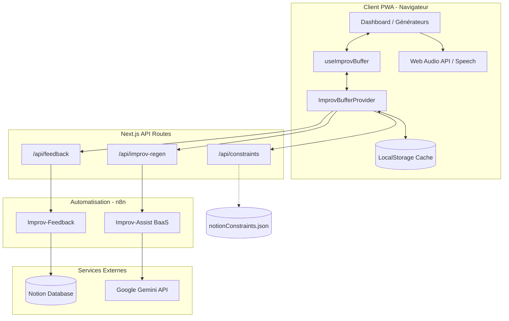

# 🎭 Houba Houba! — Architecture Technique

Ce document décrit l'architecture globale, la structure des données et les flux de communication de l'application **Houba Houba!**.

---

## 🏗️ Vue d'ensemble de l'Architecture

L'application repose sur un modèle hybride découplant l'interface utilisateur, une couche d'automatisation faisant office de *Backend-as-a-Service* (BaaS), et des intégrations tierces (Notion et Google Gemini).



---

## 📂 Structure des Répertoires

Le projet est organisé selon une structure modulaire séparant les configurations d'infrastructure, les scénarios d'automatisation, et le code source de l'application Next.js :

* **`configure`** : Script shell de diagnostic système et d'initialisation du projet (dépendances Next.js, Python et fichiers d'environnement).
* **`/docker`** : Contient les `Dockerfile` (dev et prod) et les configurations Docker Compose définissant les conteneurs et les variables d'environnement.
* **`/images`** : Héberge les captures d'écran et ressources visuelles intégrées dans la documentation du projet.
* **`/n8n`** : Versionne localement les workflows n8n (`improv-assist-baas.json` et `improv-feedback.json`) ainsi que les prompts système (`prompts/master.prompt`) pour assurer la cohérence entre les versions de code et les automatisations.
* **`/public`** : Fichiers statiques servis directement par Next.js, y compris le cache local `/data/reservoir-config.json` généré par l'IA.
* **`/scripts`** : Regroupe les outils utilitaires, notamment le script Python de peuplement du réservoir (`populate_reservoir.py`) et les scripts de validation.
* **`/src`** : Code source principal de l'application :
  * `app/` : Routes Next.js (pages de l'App Router et endpoints d'API proxifiés).
  * `components/` : Composants UI réutilisables (générateurs, modaux, vues de paramétrage).
  * `context/` : Contextes React partagés ([ImprovBufferContext.tsx](file:///c:/Projects/eole.me/improv-assist/src/context/ImprovBufferContext.tsx)) pour centraliser l'état global et les connexions n8n.
  * `hooks/` : Hooks personnalisés gérant la logique d'état ([useImprovBuffer.ts](file:///c:/Projects/eole.me/improv-assist/src/hooks/useImprovBuffer.ts), `useDevMode`, `useToast`).
  * `types/` : Déclarations de types et interfaces TypeScript.
  * `utils/` : Fonctions utilitaires partagées (`bufferUtils`).

---

## ⚖️ Choix Techniques et Justifications

* **Next.js 15 & React 19** : Ce choix offre une infrastructure performante avec le rendu hybride (Static Site Generation côté serveur pour un affichage instantané et API Routes pour servir de passerelle proxy sécurisée). Les optimisations de React 19 améliorent la gestion du cycle de vie des états locaux.
* **Centralisation de l'état avec React Context** : Afin d'éviter la fragmentation de l'état du buffer d'improvisation entre les différents composants générateurs indépendants (ce qui causait des tirages dupliqués ou désynchronisés), nous avons introduit un contexte global ([ImprovBufferContext.tsx](file:///c:/Projects/eole.me/improv-assist/src/context/ImprovBufferContext.tsx)). Toutes les opérations sur le réservoir (tirage, rechargement, synchronisation `localStorage`, bascules de secours vers n8n) passent par ce provider unique.
* **n8n comme BaaS (Backend-as-a-Service)** : L'utilisation de n8n évite d'avoir à coder, sécuriser et maintenir un serveur API traditionnel complexe (Express, Django). Les intégrations tierces (Google Gemini, Notion) sont implémentées visuellement sous forme de workflows versionnés et exportables en JSON.
* **Double système de cache (Local & Distant)** : L'expérience sur scène requiert une réactivité instantanée et une tolérance totale aux pannes réseau. Les données sont donc pré-chargées localement (`reservoir-config.json` pour les générateurs, `notionConstraints.json` pour les contraintes) et synchronisées dans le `localStorage` du client.
* **Web Audio API** : Le Timer de Scène génère des cloches et alertes sonores de manière synthétique à l'aide d'oscillateurs natifs du navigateur. Cela évite d'avoir à charger ou héberger des fichiers audio MP3 volumineux, réduisant le poids global de la PWA et garantissant son fonctionnement hors-ligne.

---

## 🧠 Défis Techniques Résolus

* **Gestion de la Réponse Vide sur Surcharge IA** : Lorsque le modèle Gemini dépasse ses quotas gratuits (erreur 429), le nœud LangChain n8n renvoyait un tableau vide `[]`, ce qui court-circuitait le reste du workflow et renvoyait un code HTTP `200` vide, cassant le parsing JSON du client. Résolu en paramétrant le nœud Gemini sur `continueErrorOutput` et en connectant son port d'erreur au nœud de secours JavaScript pour renvoyer le réservoir d'improvisation de secours.
* **Contournement des limitations de Quotas (Rate Limiting)** : La génération de 50 suggestions par l'IA consomme beaucoup de requêtes. La logique client (`useImprovBuffer.ts`) a été conçue pour consommer en priorité le réservoir local persistant, et ne solliciter le webhook n8n en temps réel que pour un seul élément à la fois en cas de réservoir complètement vide, minimisant drastiquement l'usage de jetons.
* **Hydratation React en PWA et LocalStorage** : Le chargement d'états depuis le `localStorage` du navigateur pendant la phase d'initialisation provoquait des avertissements de divergence d'hydratation (le rendu serveur de Next.js différant du stockage local du client). Ce défi a été résolu en externalisant et en isolant les lectures de stockage dans des hooks secondaires (`useDevMode`, `useToast`) et en différant l'hydratation du buffer principal dans un `useEffect` exécuté uniquement côté client.

---

## 💻 1. Couche Frontend (Client PWA)

Le frontend est construit avec **Next.js 15 (App Router)** et **React 19**. Il est conçu pour être entièrement **mobile-first**, réactif, et installable en tant que **PWA** (Progressive Web App) pour un fonctionnement hors-ligne optimal.

### Composants Clés
* **[page.tsx](file:///c:/Projects/eole.me/improv-assist/src/app/page.tsx)** : Orchestrateur central. Il gère l'état d'affichage du tableau de bord (grid de tuiles), l'ajustement dynamique de la taille du texte, l'historique virtuel de navigation, et l'affichage des modaux d'aide/RGPD.
* **[ImprovBufferContext.tsx](file:///c:/Projects/eole.me/improv-assist/src/context/ImprovBufferContext.tsx)** : Provider global qui encapsule la logique d'initialisation du buffer, le stockage local (`localStorage`), la mise à jour transactionnelle du pool de prompts et les appels vers l'API.
* **[useImprovBuffer.ts](file:///c:/Projects/eole.me/improv-assist/src/hooks/useImprovBuffer.ts)** : Hook client personnalisé consommant le contexte partagé pour exposer l'état unifié du buffer et ses contrôles (tirage, rechargement, diagnostic d'erreurs n8n) à chaque tuile de génération.
* **[CharacterGenerator.tsx](file:///c:/Projects/eole.me/improv-assist/src/components/CharacterGenerator.tsx)** : Générateur dédié affichant des archétypes de personnages avec âge suggéré, accessoire à mimer, et attitude corporelle/tic physique.
* **[ImprovTimer.tsx](file:///c:/Projects/eole.me/improv-assist/src/components/ImprovTimer.tsx)** : Chronomètre autonome utilisant la **Web Audio API** pour synthétiser des sons de cloche (sans charger de fichiers audio externes volumineux) et l'API de synthèse vocale du navigateur pour annoncer le temps.
* **[WhoStarts.tsx](file:///c:/Projects/eole.me/improv-assist/src/components/WhoStarts.tsx)** : Outil de tirage au sort interactif exploitant les événements de contact multi-touch du navigateur (`PointerEvents`) avec retour visuel immédiat.

---

## 🚦 2. Couche Proxy API & Configuration de Routage (Next.js)

Pour sécuriser les clés d'intégration, contourner les restrictions de CORS et assurer la fluidité de la PWA, Next.js sert de proxy d'API intermédiaire et gère le routage virtuel :

1. **`/api/constraints`** : Lit et sert le fichier de cache statique `notionConstraints.json` compilé localement.
2. **`/api/feedback`** : Transmet les formulaires de retour utilisateur au webhook de n8n.
3. **`/api/improv-regen`** : Transmet les demandes de génération de prompts en lot à l'automatisation n8n. Elle implémente une limite de temps stricte de 10 secondes (`AbortController`). En cas de dépassement, elle renvoie une réponse structurée de type 504 Gateway Timeout contenant `{ error: "Timeout issued (from Message a model)" }` que l'application client intercepte pour afficher un avertissement convivial.
4. **Gestion du Routage Virtuel (PWA)** : Pour éviter les erreurs 404 lors du rafraîchissement d'un navigateur sur une tuile active (ex: `/emotions`, `/timer`), des règles de réécriture (*rewrites*) dynamiques sont définies dans `next.config.mjs`. Toutes les routes (à l'exception des ressources statiques, des API et des SVGs dynamiques comme `/favicon.svg`) sont redirigées de manière transparente à la racine (`/`) grâce à un motif de lookahead négatif : `/:path((?!_next|api|data|manifest\\.json|sw\\.js|favicon\\.svg|icon\\.svg).*$)`. Cela garantit que l'ajout ou la modification de tuiles sur le tableau de bord ne nécessite aucune mise à jour de configuration de routage.

---

## ⚙️ 3. Couche Backend & Automatisation (n8n BaaS)

L'intelligence métier et les enregistrements sont gérés par deux flux d'automatisation hébergés sur un serveur **n8n** :

### A. Flux de Feedback (`Improv-Feedback`)
* **Déclencheur** : Webhook POST sur `/webhook/improv-feedback`.
* **Action** : Insère le nom, le type, la note (score 1-5 étoiles) et le commentaire dans une base de données Notion dédiée.
* **Gestion d'Erreur** : Si Notion renvoie une erreur (ex: limite d'API ou erreur de schéma), le flux intercepte l'erreur grâce à `"onError": "continue"` et renvoie un statut HTTP `500` avec la description de l'erreur au client.

### B. Flux d'IA & Génération (`Improv-Assist BaaS`)
* **Déclencheur** : Webhook POST sur `/webhook/improv-regen` (avec transmission facultative du paramètre `source` représentant l'environnement : `prod`, `dev` ou `other`).
* **Action** : Interroge le modèle **Gemini 3.5 Flash** (via LangChain) avec un prompt système structuré pour générer un lot complet d'idées d'improvisation au format JSON.
* **Télémétrie et Enregistrement Notion** : À la fin de l'exécution du flux (en parallèle avec l'envoi de la réponse webhook afin d'éviter toute latence pour l'utilisateur), le nœud `Log to Notion` enregistre la transaction dans la base de données Notion `"Houbahouba AI regen calls"` avec les propriétés suivantes :
  - **Name** : `[Regen] <catégorie>`
  - **Type** : Catégorie d'improvisation régénérée.
  - **Source** : Provenance du déclenchement (`prod` pour la PWA en production, `dev` pour l'environnement local ou le script de peuplement, `other` pour le fallback/tests).
  - **duration** : Durée totale de la génération en secondes (calculée par la différence de temps entre le nœud initial `Load Token` et le nœud final `Log to Notion`).
  - **date** : Date d'exécution.
* **Gestion d'Erreur & Timeouts** : 
  - **Limites de Temps** : Afin de s'adapter aux ~90 secondes requises par la complexité de `gemini-3.5-flash` pour générer 400 items de haute qualité, les limites de temps n8n (`executionTimeout`) ont été désactivées. 
  - **Gestion des Timeouts** : La route API proxy `/api/improv-regen` côté client impose une limite de temps stricte de 10 secondes pour garantir la réactivité sur scène de la PWA (renvoyant une structure `{ error: "Timeout issued (from Message a model)" }` interceptée par l'application). En revanche, le script d'initialisation hors-ligne `populate_reservoir.py` utilise un timeout de 180 secondes pour permettre au modèle de terminer l'ensemble de son travail de génération.
  - **Interception des échecs** : En cas de panne générale ou de quota d'API dépassé, le flux bascule automatiquement vers un nœud de code JavaScript (`Check Error and Mock`) contenant un réservoir complet de données de secours (*mock data*).

---

## 📂 4. Gestion et Synchronisation des Données

L'application utilise deux types de fichiers de données persistés localement :

1. **`notionConstraints.json`** : Contient le guide des contraintes d'impro théâtrale. Ce cache local est rafraîchi lors des phases de build ou par tâche périodique en exécutant le script d'intégration :
   ```bash
   node scripts/notion_fetch.js
   ```
2. **`reservoir-config.json`** : Réservoir de prompts utilisé par les générateurs hors-ligne. Il peut être régénéré en interrogeant l'IA via le script Python en environnement de développement :
   ```bash
   wsl python3 scripts/populate_reservoir.py
   ```

---

## 🚀 5. Déploiement et Infrastructure

L'infrastructure est entièrement conteneurisée à l'aide de Docker, sécurisée par le gestionnaire de secrets **Doppler**, et pilotée par le Makefile et GitHub Actions. Les secrets ne sont jamais écrits en clair dans le dépôt Git.

* **Gestion des Secrets (Doppler)** :
  - La CLI Doppler est installée localement et configurée sur le projet `eole-me`.
  - **WSL / Localhost** : Lors de l'exécution de `make up`, le Makefile localise de manière robuste le binaire Doppler (`$(DOPPLER)`) et télécharge dynamiquement les secrets de la configuration `dev_eole-me-impro` vers un fichier `.env` local (gitignoré).
  - **Production (VPS)** : Lors d'un déploiement (`make deploy`), les secrets de la configuration `prd_eole-me-impro` sont récupérés en direct depuis Doppler et diffusés via un tunnel SSH (`doppler secrets download ... | ssh ... "cat > .env"`) directement vers le serveur de production sans jamais transiter en clair par le système de fichiers local du développeur.
* **WSL / Localhost** : Environnement de développement lancé via Docker Compose et géré localement à l'aide de raccourcis Makefile :
  * `make up` : Lance le serveur Next.js en mode développement avec Hot Module Replacement (HMR) sur le port 3000 après injection des secrets Doppler.
  * `make down` : Éteint le conteneur proprement.
  * `make restart` : Redémarre l'environnement.
* **VPS (Production - impro.eole.me)** :
  * **CI/CD** : Chaque push sur la branche `main` déclenche un workflow GitHub Actions qui compile une image de production Docker immuable et la publie sur le registre GitHub Packages (GHCR).
  * **Déploiement** : La commande `make deploy-delay` permet de diffuser les configurations et variables d'environnement de production en direct depuis Doppler via SSH sur le VPS, d'attendre la fin de la compilation CI/CD (150s), puis de recréer les conteneurs de production derrière le proxy inverse **Traefik** (uniquement pour https://impro.eole.me).

---

## 🛠️ 6. Procédure de Disaster Recovery (Nouvelle Instance)

En cas de perte de données complète, de panne du serveur BaaS, ou de réinstallation sur une nouvelle machine / serveur, suivez cette procédure pour restaurer l'écosystème :

### A. Initialisation Système et Clés d'Environnement
1. Lancez le script de configuration à la racine :
   ```bash
   ./configure
   ```
2. Le script vérifiera toutes les dépendances locales (Node, Docker, Python), créera le fichier `.env` et vous demandera de renseigner interactivement les clés requises :
   * **`NOTION_API_KEY`** : Jeton d'intégration de votre espace de travail Notion.
   * **`NOTION_DATABASE_ID`** : ID de la table Notion contenant les Contraintes d'Improvisation.
   * **`X_N8N_TOKEN`** : Jeton de sécurité pour sécuriser les appels webhook Next.js -> n8n.

### B. Restauration de la Synchronisation Notion
1. Associez l'intégration Notion de votre troupe à la base de données de contraintes (dans Notion, allez sur la base de données, cliquez sur `...` -> `Connections` -> sélectionnez votre intégration).
2. Lancez la synchronisation locale pour recompiler le fichier `notionConstraints.json` :
   ```bash
   node scripts/notion_fetch.js
   ```

### C. Restauration du BaaS n8n et Télémétrie
1. Importez les configurations de flux de [improv-assist-baas.json](file:///c:/Projects/eole.me/improv-assist/n8n/improv-assist-baas.json) et [improv-feedback.json](file:///c:/Projects/eole.me/improv-assist/n8n/improv-feedback.json) dans votre nouvelle instance n8n.
2. Liez les nœuds Notion à vos nouvelles bases de données (si les IDs ont changé, modifiez-les dans le JSON local ou directement dans l'interface visuelle n8n).
3. Déployez le workflow n8n en exécutant le script :
   ```bash
   node scratch/push_production_workflow.js
   ```

### D. Proposition d'Architecture Alternative (Migration Hors-Notion)
Si Notion s'avère trop lent ou sujet à des blocages d'API (Rate Limiting), la structure modulaire de n8n permet de rediriger les logs et la synchronisation vers d'autres outsourcers :
* **Supabase / PostgreSQL** : Option recommandée pour une latence minimale et des requêtes SQL performantes. n8n intègre des nœuds PostgreSQL natifs qui s'exécutent en < 50ms (contre 1-2s pour Notion).
* **Airtable** : Alternative low-code plus réactive que Notion avec une API mieux structurée.

