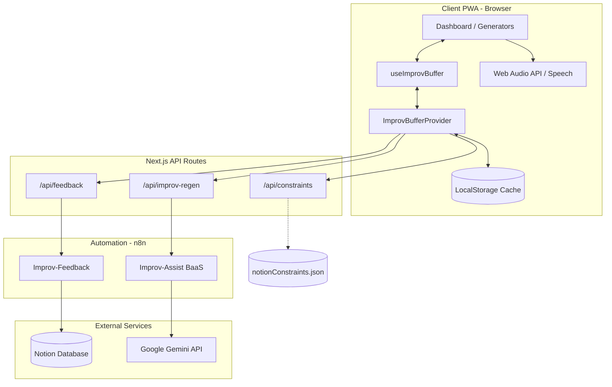

# 🎭 Houba Houba! — Technical Architecture

This document describes the overall architecture, the data structures and the communication flows of the **Houba Houba!** application.

---

## 🏗️ Architecture Overview

The application rests on a hybrid model that decouples the user interface, an automation layer acting as a *Backend-as-a-Service* (BaaS), and third-party integrations (Notion and Google Gemini).



---

## 📂 Directory Structure

The project follows a modular structure separating infrastructure configuration, automation scenarios, and the source code of the Next.js application:

* **`configure`** : Shell script for system diagnostics and project initialisation (Next.js and Python dependencies, environment files).
* **`/docker`** : Holds the `Dockerfile`s (dev and prod) and the Docker Compose configurations defining the containers and their environment variables.
* **`/images`** : Hosts the screenshots and visual assets embedded in the project documentation.
* **`/n8n`** : Versions the n8n workflows locally (`improv-assist-baas.json` and `improv-feedback.json`) along with the system prompts (`prompts/master.prompt`), keeping code releases and automations consistent with each other.
* **`/public`** : Static files served directly by Next.js, including the AI-generated local cache `/data/reservoir-config.json`.
* **`/scripts`** : Utility tooling, notably the Python reservoir population script (`populate_reservoir.py`) and the validation scripts.
* **`/toolkit`** : Maintenance scripts run by hand or by CI (`check_build.py`, `refresh-pool.mjs`).
* **`/src`** : Main application source code:
  * `app/` : Next.js routes (App Router pages and proxied API endpoints).
  * `components/` : Reusable UI components (generators, modals, settings views).
  * `context/` : Shared React contexts ([ImprovBufferContext.tsx](file:///c:/Projects/eole.me/improv-assist/src/context/ImprovBufferContext.tsx)) centralising global state and the n8n connections.
  * `hooks/` : Custom hooks holding the state logic ([useImprovBuffer.ts](file:///c:/Projects/eole.me/improv-assist/src/hooks/useImprovBuffer.ts), `useDevMode`, `useToast`).
  * `types/` : TypeScript type declarations and interfaces.
  * `utils/` : Shared utility functions (`bufferUtils`).

---

## ⚖️ Technical Choices and Rationale

* **Next.js 15 & React 19** : Gives a performant foundation with hybrid rendering (server-side Static Site Generation for instant display, API Routes to act as a secure proxy gateway). React 19's optimisations improve how the local state lifecycle is handled.
* **Centralising state with React Context** : To stop the improvisation buffer state from fragmenting across independent generator components — which produced duplicated or desynchronised draws — a global context was introduced ([ImprovBufferContext.tsx](file:///c:/Projects/eole.me/improv-assist/src/context/ImprovBufferContext.tsx)). Every reservoir operation (draw, reload, `localStorage` synchronisation, fallback to n8n) goes through that single provider.
* **n8n as a BaaS (Backend-as-a-Service)** : Using n8n avoids writing, securing and maintaining a complex traditional API server (Express, Django). Third-party integrations (Google Gemini, Notion) are implemented visually, as workflows versioned and exportable as JSON.
* **Two-tier cache (local & remote)** : On-stage use demands instant response and complete tolerance to network failure. Data is therefore preloaded locally (`reservoir-config.json` for the generators, `notionConstraints.json` for the constraints) and synchronised into the client's `localStorage`.
* **Web Audio API** : The Stage Timer synthesises its bells and audio alerts with the browser's native oscillators. That avoids loading or hosting heavy MP3 files, keeps the PWA small, and guarantees it works offline.

---

## 🧠 Technical Challenges Solved

* **Empty response when the AI is overloaded** : When the Gemini model exceeded its free quota (error 429), the n8n LangChain node returned an empty array `[]`, which short-circuited the rest of the workflow and answered an empty HTTP `200`, breaking the client's JSON parsing. Solved by setting the Gemini node to `continueErrorOutput` and wiring its error port to the JavaScript fallback node, which returns the backup reservoir.

  **What that costs, and it is not small:** the webhook then answers `200` with a complete, well-shaped reservoir that is indistinguishable from a generation. Measured over 39 runs, **18 of them (46%) were the fallback** — the model returning an empty item, sometimes in 400ms (an outright rate-limit refusal), sometimes after 30s. It is the right behaviour on stage, where serving something beats serving nothing, and the wrong behaviour for any caller that records the answer: seven of the ten categories in the shipped pool are identical, item for item, to the mock in that node. Since 0.17.0 the fallback labels itself: the mock carries `"fallback": true`, so a caller can tell canned data from a generation instead of judging the answer's content. The weekly refresh refuses such a response outright, and the PWA says "réservoir de secours servi" rather than passing it off as a regeneration.
* **Working around quota limits (rate limiting)** : Having the AI generate 50 suggestions costs a lot of requests. The draw therefore follows a three-stage cascade, implemented in `pickItem` ([ImprovBufferContext.tsx](file:///c:/Projects/eole.me/improv-assist/src/context/ImprovBufferContext.tsx)) : the persistent local reservoir first, then the pool shipped with the image (`/data/reservoir-config.json`, free and revalidated by the browser), and the n8n webhook only as a last resort, for a single item at a time. Since 0.13.0, the six categories that `buildBufferFromData` backs with its static datasets (`emotions`, `locations`, `eras`, `characters`, `animals`, `objects`) never reach the paid path at all.
* **React hydration in a PWA, and LocalStorage** : Loading state from the browser's `localStorage` during initialisation produced hydration mismatch warnings, Next.js's server render differing from the client's local storage. Solved by moving the storage reads out into secondary hooks (`useDevMode`, `useToast`) and deferring the main buffer's hydration to a `useEffect` that runs on the client only.

---

## 💻 1. Frontend Layer (Client PWA)

The frontend is built with **Next.js 15 (App Router)** and **React 19**. It is entirely **mobile-first**, responsive, and installable as a **PWA** (Progressive Web App) for offline use.

### Key Components
* **[page.tsx](file:///c:/Projects/eole.me/improv-assist/src/app/page.tsx)** : Central orchestrator. It drives the dashboard display state (the tile grid), the dynamic text sizing, the virtual navigation history, and the help/GDPR modals.
* **[ImprovBufferContext.tsx](file:///c:/Projects/eole.me/improv-assist/src/context/ImprovBufferContext.tsx)** : Global provider wrapping the buffer initialisation logic, local storage (`localStorage`), the transactional update of the prompt pool, and the API calls.
* **[useImprovBuffer.ts](file:///c:/Projects/eole.me/improv-assist/src/hooks/useImprovBuffer.ts)** : Custom client hook consuming the shared context to expose the unified buffer state and its controls (draw, reload, n8n error diagnostics) to every generator tile.
* **[CharacterGenerator.tsx](file:///c:/Projects/eole.me/improv-assist/src/components/CharacterGenerator.tsx)** : Dedicated generator showing character archetypes with a suggested age, a prop to mime, and a body attitude or physical tic.
* **[ImprovTimer.tsx](file:///c:/Projects/eole.me/improv-assist/src/components/ImprovTimer.tsx)** : Standalone stopwatch using the **Web Audio API** to synthesise bell sounds (without loading heavy external audio files) and the browser's speech synthesis API to announce the time.
* **[WhoStarts.tsx](file:///c:/Projects/eole.me/improv-assist/src/components/WhoStarts.tsx)** : Interactive draw tool built on the browser's multi-touch contact events (`PointerEvents`), with immediate visual feedback.

---

## 🚦 2. API Proxy Layer & Routing Configuration (Next.js)

To keep integration keys secret, work around CORS restrictions and keep the PWA fluid, Next.js acts as an intermediate API proxy and handles virtual routing:

1. **`/api/constraints`** : Reads and serves the locally compiled static cache file `notionConstraints.json`.
2. **`/api/feedback`** : Forwards user feedback forms to the n8n webhook.
3. **`/api/telemetry`** : Stamps `application: "improv"` on the event and forwards it to Vector, which ships it to the Axiom `eole-telemetry` dataset. Client events go through `sendTelemetry` ([src/utils/telemetry.ts](file:///c:/Projects/eole.me/improv-assist/src/utils/telemetry.ts)), which carries the dev and opt-out guards: `tile_used`, `pool_refill` when a category is refilled from the shipped pool, and `regen_fallback` when n8n answers with canned data.
4. **`/api/improv-regen`** : Forwards batch prompt generation requests to the n8n automation. It also accepts an `avoid` array of up to 500 strings, appended to the system prompt — before the footer, which must stay last — as a "do not propose these" block. It allows the answer 120 seconds (`REGEN_TIMEOUT_MS`, `AbortController`) : the workflow's Gemini node takes 11 to 19 seconds for a single category, and up to ~90 seconds for 400 items. Past that it answers a structured 504 Gateway Timeout carrying `{ error: "Timeout issued (from Message a model)" }`, which the client intercepts — through `readErrorMessage` — to show a friendly warning.
5. **Virtual routing for the PWA** : To avoid 404s when a browser is refreshed on an active tile (e.g. `/emotions`, `/timer`), dynamic *rewrites* are declared in `next.config.mjs`. Every route (except static assets, the APIs, and dynamic SVGs such as `/favicon.svg`) is transparently redirected to the root (`/`) through a negative lookahead pattern: `/:path((?!_next|api|data|manifest\\.json|sw\\.js|favicon\\.svg|icon\\.svg).*$)`. Adding or changing a dashboard tile therefore needs no routing configuration update.

---

## ⚙️ 3. Backend & Automation Layer (n8n BaaS)

The business logic and the records are handled by two automation flows hosted on an **n8n** server:

### A. Feedback flow (`Improv-Feedback`)
* **Trigger** : POST webhook on `/webhook/feedback` — the single intake shared with www and jobby. `/webhook/improv-feedback` was retired in July.
* **Action** : Inserts the name, the type, the rating (1-5 stars) and the comment into a dedicated Notion database.
* **Error handling** : If Notion answers an error (API limit, schema error), the flow catches it through `"onError": "continue"` and returns HTTP `500` with the error description to the client.

### B. AI & generation flow (`Improv-Assist BaaS`)
* **Trigger** : POST webhook on `/webhook/improv-regen` (optionally carrying a `source` parameter for the environment: `prod`, `dev` or `other`).
* **Action** : Queries the **Gemini 3.5 Flash** model (through LangChain) with a structured system prompt to generate a full batch of improvisation ideas as JSON.
* **Telemetry** : the `Log to Vector` node posts `application: "improv"`, `event_type: "regen_request"` and `environment: "prod"` — the canonical vocabulary. It sent `reservoir_idees`, `action` and `production` until 2026-09-26: a fix committed to this repo in `ba0472e` had never been pushed to the instance, so no query on `application` ever saw the whole app.
* **Telemetry and Notion record** : At the end of the run — in parallel with sending the webhook response, so the user waits for nothing — the `Log to Notion` node records the transaction in the Notion database `"Houbahouba AI regen calls"` with these properties:
  - **Name** : `[Regen] <category>`
  - **Type** : The improvisation category that was regenerated.
  - **Source** : Where the trigger came from (`prod` for the production PWA, `dev` for the local environment or the population script, `other` for fallback/tests).
  - **duration** : Total generation time in seconds (the difference between the first node, `Load Token`, and the last one, `Log to Notion`).
  - **date** : Run date.
* **Error handling & timeouts** :
  - **Time limits** : To accommodate the ~90 seconds `gemini-3.5-flash` needs to generate 400 high-quality items, n8n's own time limits (`executionTimeout`) are disabled.
  - **Timeout handling** : The `/api/improv-regen` proxy route allows n8n 120 seconds, enough to cover a full generation. The 10 seconds it enforced up to 0.12.1, chosen for on-stage responsiveness, were shorter than the generation itself: on 24 September 2026, twelve consecutive attempts ended in a 504 while the twelve matching n8n executions had **succeeded** — the reservoir was generated, recorded in Notion, then discarded on the way back. The offline population script `populate_reservoir.py` uses a 180-second timeout of its own.
  - **Catching failures** : On a general outage or an exhausted API quota, the flow falls back to a JavaScript code node (`Check Error and Mock`) holding a complete backup reservoir (*mock data*).

---

## 📂 4. Data Management and Synchronisation

The application persists two kinds of data files locally:

1. **`notionConstraints.json`** : Holds the theatrical improvisation constraints guide. This local cache is refreshed at build time or by a periodic task, by running the integration script:
   ```bash
   node scripts/notion_fetch.js
   ```
2. **`reservoir-config.json`** : The prompt reservoir used by the offline generators. It is regenerated automatically **every Saturday at 06:00 UTC** by the [refresh-pool.yml](file:///c:/Projects/eole.me/improv-assist/.github/workflows/refresh-pool.yml) workflow, which queries `/api/improv-regen` and commits the result to `main`: one generation a week serves every client, where each user used to pay for their own. Three rules, each of which exists because its absence did damage:

   - **Three categories per run, not ten**, on a window that advances with the week number — every category comes round in ten weeks, with no cursor to store. Ten calls in a row exhausted the free tier: of the ten the first scheduled run made, seven were refused.
   - **Sixty seconds between calls.** At 25 seconds, Gemini refused outright after two or three had gone through, in under 500ms.
   - **A fallback response is refused.** The workflow labels its own mock with `"fallback": true`, which the refresh checks first; a response with no new item is still treated as a failure as a second net. Without either rule the job wrote canned data over real generated content, and did.

   Each request also carries the category's current items as `avoid`, so the model is asked for something the reservoir does not already hold. A category that comes back empty, truncated below half its size, or in error keeps the items already shipped. The new pool reaches production at the next `make deploy`.
   ```bash
   make refresh-pool                                    # by hand, every category
   POOL_CATEGORIES=animals,objects make refresh-pool    # partially
   wsl python3 scripts/populate_reservoir.py            # historical offline alternative
   ```

---

## 🚀 5. Deployment and Infrastructure

The infrastructure is fully containerised with Docker, secured by the **Doppler** secret manager, and driven by the Makefile and GitHub Actions. Secrets are never written in clear text into the Git repository.

* **Secret management (Doppler)** :
  - The Doppler CLI is installed locally and configured against the `eole-me` project.
  - **WSL / localhost** : On `make up`, the Makefile robustly locates the Doppler binary (`$(DOPPLER)`) and downloads the secrets of the `dev_eole-me-impro` config into a local, gitignored `.env`.
  - **Production (VPS)** : On `make deploy`, the secrets of the `prd_eole-me-impro` config are fetched live from Doppler and streamed over SSH (`doppler secrets download ... | ssh ... "cat > .env"`) straight to the production server, without ever passing in clear text through the developer's local filesystem.
* **WSL / localhost** : Development environment started through Docker Compose and managed with Makefile shortcuts:
  * `make up` : Starts the Next.js server in development mode with Hot Module Replacement (HMR) on port 3000, after injecting the Doppler secrets.
  * `make down` : Shuts the container down cleanly.
  * `make restart` : Restarts the environment.
* **VPS (production — impro.eole.me)** :
  * **CI/CD** : Every push to `main` triggers a GitHub Actions workflow that compiles an immutable Docker production image and publishes it to the GitHub Packages registry (GHCR).
  * **Deployment** : `make deploy-delay` streams the production configuration and environment variables live from Doppler over SSH to the VPS, waits for the CI/CD build to finish (150s), then recreates the production containers behind the **Traefik** reverse proxy (for https://impro.eole.me only).

---

## 🛠️ 6. Disaster Recovery Procedure (New Instance)

In case of complete data loss, a BaaS server outage, or a reinstall on a new machine or server, follow this procedure to restore the ecosystem:

### A. System initialisation and environment keys
1. Run the configuration script at the root:
   ```bash
   ./configure
   ```
2. The script checks every local dependency (Node, Docker, Python), creates the `.env` file, and asks you interactively for the required keys:
   * **`NOTION_API_KEY`** : Integration token for your Notion workspace.
   * **`NOTION_DATABASE_ID`** : ID of the Notion table holding the improvisation constraints.
   * **`X_N8N_TOKEN`** : Security token protecting the Next.js -> n8n webhook calls.

### B. Restoring the Notion synchronisation
1. Connect your troupe's Notion integration to the constraints database (in Notion, open the database, click `...` -> `Connections` -> pick your integration).
2. Run the local synchronisation to recompile `notionConstraints.json`:
   ```bash
   node scripts/notion_fetch.js
   ```

### C. Restoring the n8n BaaS and the telemetry
1. Import the flow configurations from [improv-assist-baas.json](file:///c:/Projects/eole.me/improv-assist/n8n/improv-assist-baas.json) and [improv-feedback.json](file:///c:/Projects/eole.me/improv-assist/n8n/improv-feedback.json) into your new n8n instance.
2. Point the Notion nodes at your new databases (if the IDs changed, edit them in the local JSON or directly in the n8n canvas).
3. Deploy the n8n workflow by running:
   ```bash
   node scratch/push_production_workflow.js
   ```

### D. Alternative architecture (migrating off Notion)
If Notion turns out to be too slow or too prone to API rate limiting, n8n's modular structure allows the logs and the synchronisation to be pointed at other providers:
* **Supabase / PostgreSQL** : The recommended option for minimal latency and efficient SQL queries. n8n ships native PostgreSQL nodes that run in < 50ms, against 1-2s for Notion.
* **Airtable** : A low-code alternative, more responsive than Notion, with a better structured API.
