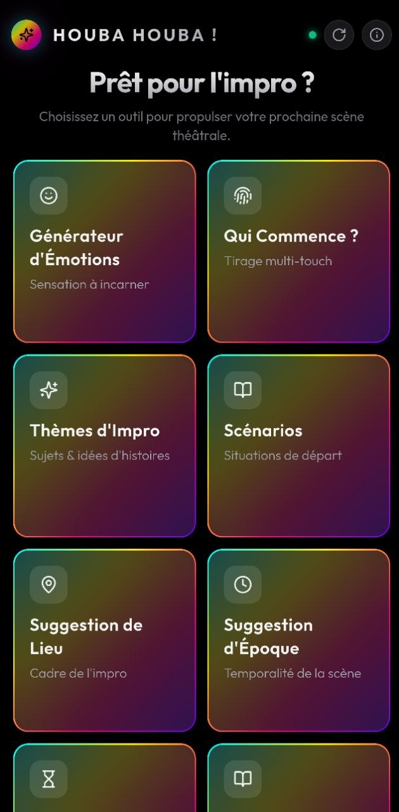

# 🎭 Houba Houba !

<p align="center">
  
</p>

`Houba Houba !` est une Progressive Web Application (PWA) moderne et mobile-first conçue pour aider les comédiens et arbitres de théâtre d'improvisation lors des entraînements, ateliers et matchs. Elle fournit des outils pour tirer au sort des paramètres de scène, chronométrer les improvisations et consulter les règles et contraintes de jeu.

L'application arbore un design sombre soigné, enrichi de reflets irisés vibrants et de glassmorphisme, adapté aux écrans mobiles pour une utilisation instantanée. 50 thèmes sont disponibles au lancement. Ils sont à usage unique : lorsque la file d'attente est vide, il faut régénérer les thèmes grâce au workflow n8n/Gemini ou en cliquant sur l'icône de rotation.

---

[](https://github.com/gnueole/improv-assist/actions/workflows/build-image.yml)

## 🌟 Key Features

| Fonctionnalité | Description |
| :--- | :--- |
| **🎭 Générateur d'Émotions** | Suggère une émotion de jeu aléatoire accompagnée d'un curseur d'intensité de **1 à 10**. |
| **👆 Qui Commence ? (Multi-touch)** | Tirage au sort interactif pour désigner qui débute la scène. Posez jusqu'à 5 doigts sur l'écran. Après un décompte de 3 secondes, le vainqueur est choisi aléatoirement. |
| **✨ Thèmes d'Impro** | Suggère des sujets de jeu et des idées d'histoires poétiques ou comiques. |
| **⏳ Timer de Scène** | Chronomètre préréglé sur 2 minutes 30 secondes avec neon glow, buzzer de fin (chime arpeggio ascendant) et effet vibratoire d'urgence. |
| **🎬 Scénarios** | Fournit des situations de départ et intrigues scénarisées avec des explications et briefs pour lancer la scène. |
| **📍 Suggestion de Lieu** | Suggestions créatives instantanées de cadres physiques pour planter le décor de vos scènes. |
| **🕰️ Suggestion d'Époque** | Suggestions instantanées de temporalités (Moyen Âge, futur, années 80) pour situer vos histoires. |
| **📚 Contraintes d'Impro** | Affiche les contraintes et règles théâtrales issues de l'espace de travail Notion de la troupe. |
| **🤸 Échauffements** | Liste d'exercices collectifs ou individuels avec des descriptions et conseils pour se préparer au jeu. |
| **⚡ Règles du Hi Ha** | Guide de référence rapide listant les gestes officiels du jeu d'échauffement collectif Hi Ha. |
| **💬 Retour & Idées** | Formulaire de retours d'expérience et de suggestions d'améliorations connecté à Notion via n8n. |
| **📦 Réservoir de Prompts (Data Pool)** | Les suggestions sont piochées dans un réservoir local et consommées sans doublon. Si le réservoir se vide, 50 nouveaux items sont rechargés depuis n8n. |
| **🔄 Régénération par l'IA (Gemini via n8n)** | Permet de recharger le cache local avec de nouveaux prompts générés à la volée par Gemini en cliquant sur l'icône de rotation. |
| **🚦 Indicateur de connexion (n8n)** | Un voyant lumineux indique la disponibilité du service n8n/Gemini (vert/rouge) avec retour d'erreurs détaillé pour les développeurs. |

---

## ⚙️ Synchronisation Notion

Le cache local est généré en synchronisant certaines données depuis Notion vers `src/data/notionConstraints.json` pour un fonctionnement hors-ligne optimal :
```bash
node scripts/notion_fetch.js
```

---

## 🚀 Démarrage Rapide

### Prérequis
- Docker (testé avec WSL2)
- Node.js (version 20+)
- npm
- Une base de données (Notion ou autre) pour interfacer avec les prompts de l'application (optionnel).
- Un compte n8n pour interfacer avec les prompts de l'application, l'IA et les envois d'emails (optionnel).
- Une clé Gemini pour régénérer des prompts de remplacement (optionnel).

### Installation & Développement Local

1. **Installer les dépendances** :
   ```bash
   npm install
   ```

2. **Lancer le serveur de développement** :
   ```bash
   npm run dev
   ```
   Ouvrez [http://localhost:3000](http://localhost:3000) dans votre navigateur.

3. **Compiler et démarrer le bundle de production** :
   ```bash
   npm run build
   npm start
   ```

---

## 🏗️ Architecture Technique

Pour en savoir plus sur l'organisation des composants client, l'orchestration des API proxies, la logique d'automatisation n8n et l'infrastructure de déploiement, veuillez consulter le document **[Architecture.md](Architecture.md)**.

---

## 🐳 Docker & Makefile

L'application est entièrement conteneurisée et gérée de manière simplifiée à l'aide d'un `Makefile` en local ou dans WSL.

| Commande | Action |
| :--- | :--- |
| `make up` | Démarre le conteneur de développement local avec HMR (Port 3000 - [http://localhost:3000](http://localhost:3000)) |
| `make down` | Arrête le conteneur de développement local |
| `make restart` | Redémarre l'environnement de développement local (down puis up) |
| `make deploy` | Déploie automatiquement l'application sur le VPS de production |
| `make deploy-delay` | Envoie les commits, attend 150 secondes pour laisser le temps à GitHub Actions de compiler, puis déploie |
| `make checklogs` | Affiche les journaux de production du VPS en temps réel |

### Résolution d'erreur 504 (Passerelle Traefik)
Si le VPS renvoie une erreur *504 Gateway Timeout*, reconnectez le réseau de Traefik au conteneur de l'application :
```bash
ssh eole.me "docker network connect jobby-md2html_default <nom_du_conteneur_traefik>"
```

---

## 🛠️ Stack & Technologies

- **Frontend** : Next.js 15 (App Router), React 19, TypeScript
- **Styling** : Tailwind CSS 3 (Grid responsive 2 colonnes avec tuiles carrées en Glassmorphism), PostCSS
- **Icones** : Lucide React (normalisées en taille et épaisseur pour une parfaite cohérence visuelle)
- **Déploiement** : Docker Standalone multi-stage via GHCR

---

## 📋 Wishlist / Todo

Voici les fonctionnalités futures envisagées (ou pas, ou pas) pour enrichir l'application :
- [ ] **Idées de tuiles à rajouter** : 
  - Personnas avec tips et variantes
  - Animaux 
  - Objets
  - Un grand mixer pour créer ses propres combinaisons les plus folles !

- [ ] **Ajout de nouvelles tuiles freemium/premium** : Pour financer l'application (voire la rendre pérenne), il faudrait ajouter de nouvelles tuiles personalisées payantes ou via un abonnement mensuel/annuel.
- [ ] **Application Mo MOBILE** : Développer une application mobile pour Android et iOS. Cela permettrait d'avoir des notifications push, des widgets, etc.
- [ ] **Mode Hors-ligne 100% autonome (Service Worker)** : Améliorer le cache de l'application pour un fonctionnement optimal sans connexion réseau via un Service Worker robuste.
- [ ] **Historique de jeu & Historique des tirages** : Garder une trace locale (dans le `localStorage`) des 10 dernières improvisations jouées pour éviter les doublons absolus d'une séance sur l'autre.
- [ ] **Timer avancé avec buzzer** : Ajouter des sons de buzzer de fin configurables, ainsi que la possibilité de régler le temps libre.
- [ ] **Multilingue (FR / EN)** : Traduction complète de l'application pour l'usage dans des festivals ou ateliers internationaux.

---

## 📝 Changelog

### Version 0.4 BETA (0.4-beta / 1.0.0-beta.4) - 2026-06-11
- **Restauration des retours Notion (Notion Feedback)** : Remplacement de l'ajout de blocs Notion bogué par un nœud standard `httpRequest` dans n8n. Reconfiguration de la structure des données pour ajouter de vrais en-têtes natifs Notion (`## Details`, `## Message`) et des puces de liste de type `bulleted_list_item` lors des envois de retours.
- **Raccourcis clavier PC & Navigation de grille** : Ajout d'une gestion complète de navigation au clavier pour ordinateur :
  - Flèches directionnelles (`Haut`, `Bas`, `Gauche`, `Droite`) pour naviguer entre les tuiles de la grille du tableau de bord avec un effet visuel d'échelle et une lueur irisée réactive.
  - Touches `Entrée` ou `Espace` pour ouvrir la tuile sélectionnée ou lancer le tirage dans les générateurs.
  - Flèches `Droite` / `Bas` pour passer au générateur suivant depuis une vue de détail, et `Haut` pour aller au précédent.
  - Flèches `Gauche` / `Échap` / `Esc` pour retourner au tableau de bord ou fermer tout modal actif.
  - Touches `a` ou `i` pour afficher/masquer le modal À propos, et touche `g` pour régénérer le réservoir de prompts.
  - Touche `m` pour ouvrir directement le formulaire de retours (Feedback), touche `h` pour les règles du HiHa, et `?` pour afficher le Guide d'aide.
  - Touche `d` pour activer/désactiver le mode développeur, et touche `p` pour inspecter le prompt système Gemini en mode DEV.
  - Contournement intelligent pour désactiver automatiquement les raccourcis lorsque l'utilisateur tape du texte dans un formulaire.
- **Recharges optimisées du réservoir** : Refonte de la recharge lorsque le réservoir est vide pour récupérer 50 nouveaux éléments depuis n8n d'un coup et les fusionner dans la file d'attente globale en `localStorage`, évitant ainsi des requêtes n8n réseau répétitives et garantissant une utilisation hors-ligne fluide.
- **Amélioration du Timer Théâtral** :
  - Remplacement du buzzer final descendant par un carillon arpège ascendant synthétisé en 4 étapes ("uptone") grâce à l'API Web Audio.
  - Ajout d'un effet de lueur néon haute visibilité sur l'affichage du temps (lueur rouge intense les 30 dernières secondes, doublée les 5 dernières secondes) pour une parfaite lisibilité sur tous les gradients.
  - Intégration d'une animation dynamique de rebond prononcé (`scale-panic` jusqu'à 1,6x) durant le compte à rebours critique des 5 dernières secondes.
- **Polissage UI & UX** :
  - Déplacement des compteurs de suggestions restantes à l'intérieur des cartes de générateurs pour un rendu épuré.
  - Simplification du badge d'activation du mode développeur de "devMode" en "DEV".
  - Mise à jour globale de toutes les mentions de version vers la version 0.4 BETA dans les fenêtres modales, la section d'aide et les documentations techniques.

### Version 0.3 BETA (0.3-beta) - 2026-06-10
- **Refactoring & Centralisation (React Context)** : Migration du buffer d'improvisation vers un Context Provider global (`ImprovBufferContext`) pour synchroniser les tirages entre tous les générateurs, éliminer les tirages doublons et éviter les requêtes n8n concurrentes. Découpage modulaire du hook en sous-hooks (`useToast`, `useDevMode`) et utilitaires (`bufferUtils`).
- **Optimisation n8n & Réservoir de secours** : Extension du réservoir hors-ligne à **50 entrées par catégorie** (350 prompts au total) et sécurisation du workflow n8n via un double-port (succès/erreur) pour garantir le retour systématique du réservoir de secours lors des surcharges du modèle Gemini.
- **Ajout d'échauffements & Descriptions** : Intégration de descriptions explicatives en français pour les exercices d'échauffement et les contraintes (catégories) de jeu, guidant l'utilisateur directement depuis l'interface.
- **Ponçage des thèmes & Générateurs** : Enrichissement et affinage des listes de thèmes, époques, émotions et lieux pour maximiser la variété dramatique.
- **Envoi de feedback & RGPD** : Sélecteur de note par balayage/glissement tactile ou souris (1 à 5 étoiles) avec émoticônes dynamiques connecté à Notion ou la base de votre choix (via n8n), validation obligatoire du consentement RGPD et intégration d'un modal de politique de confidentialité.
- **Intégration de Feedback Email** : Mise en place d'un formulaire de feedback permettant aux utilisateurs de partager leurs expériences directement depuis l'application. Les données sont transmises via un workflow n8n qui envoie un email récapitulatif au propriétaire du site.
- **Conditions générales d'utilisation** : Ajout d'un modal de conditions générales d'utilisation conforme au RGPD et validation explicite du consentement utilisateur sur le formulaire de retour.

### Version BETA 2 (0.2-beta) - 2026-06-09
- **Architecture & Refactoring JSON** : Déplacement de la configuration des tuiles du tableau de bord et des données de repli des générateurs (émotions, lieux, époques) vers des fichiers JSON externes (`tiles.json`, `reservoir-config.json`).
- **Description des échauffements** : Ajout d'un champ description explicatif en français pour chaque exercice d'échauffement dans l'interface et le prompt système Gemini.
- **Robustesse n8n & Notion** : Gestion proactive des échecs d'API Notion dans le workflow n8n (renvoi d'une erreur 500 explicite et propagation propre au client).
- **Simplification Docker & Makefile** : Harmonisation des commandes de démarrage local (`make up` / `make down` / `make restart`) et isolation réseau locale complète pour éviter tout conflit de ports ou de réseaux Docker. Ajout de `make deploy-delay` pour automatiser l'attente du cycle de build CI/CD.
- **Normalisation du code** : Ajout d'en-têtes de commentaires de métadonnées normalisés pour toutes les classes, interfaces et routes d'API de l'application.

### Version Beta 1 (0.1-beta)
- Corrections de bugs.
- **Privacy & RGPD** : Ajout d'un modal de politique de confidentialité conforme au RGPD et validation explicite du consentement utilisateur sur le formulaire de retour.
- **Chemins d'URL dynamiques & Routage** : Association de chaque tuile à un sous-chemin d'URL dédié (ex: `/emotions`, `/timer`) pour un accès direct, avec des règles de réécriture (*rewrites*) Next.js pour empêcher les erreurs 404 lors du rafraîchissement d'une page.
- **Ajusteur de taille de texte** : Boutons d'ajustement dynamique de taille de police (Standard, Grand, Très Grand) dans l'Aide avec mémorisation persistante dans le `localStorage`.
